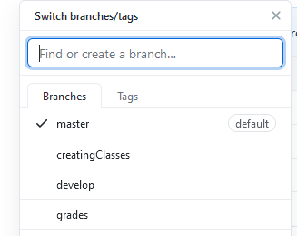

# Demonstrating Software Quality

## Scrum sprint backlog and task estimation

#### Sprint backlog
| Task No. | Task description | Task owner | Story points |
| ----------- | ----------- | ----------- | ----------- |
| 1 | Create classes| Malachy | 1 |
| 2 | Create rubric| Malachy | 1 |
| 3 | Create criteria | Malachy | 1 | 
| 4 | Create grade for student | Malachy | 2 | 
| 5 | Create funcionality for viewing rubrics and criteria | Malachy | 2 | 
| 6 | Design average, min, max and std.dev for rubric / criteria| Malachy | 3 | 
| 7 | Design tests for each function along the way | Malachy | 1 | 
| 8 | Code review | Malachy | 1 | 

## Task estimation

I have decided to use story points to visually represent the amount of effort each task should
 take for the team. Team members should meet prior to any code being written to discuss the backlog. A story point is
 a metric representing the amount of effort a task on the backlog is worth. As you can see, I have 
 tried to break down the tasks so that no one task dwarfs the others in enormity. For example, it should, in 
 theory, take twice as much effort to create a student's grade than it takes to create the rubric. This provides
 the team with a great way to estimate the size of the various pieces of work within the backlog.

 
 #### Velocity metric
 
In scrum, the term velocity describes the total amount of the sprint backlog that was manifested
 into an actual piece of the product during a sprint. The velocity metric is integral to the 
 successful running of a scrum team. At the end of a sprint, the team can use the velocity metric 
 to identify work load going forward. For example, if at the end of the sprint, the team has only 
 cleared half the backlog that was forecase then the following sprints goals should be adjusted
 to reflect this.

 
 ## Unit testing and Test-Driven development
 
 
The tool I used for code coverage is the development process that was followed throughout this
 project. It involves writing a unit test for a feature. The developer will then focus solely on 
 making that unit test pass.

 
 An example of test driven development within this project is during the creation of [creating a student grade](https://github.com/malachykeaveny/SQA_CA_2_2021/commit/bec9e589d6a5072aa8eba4c480b9ed78fdab64df).
 Within this commit, we can observe the test being written in UnitTest.Java. The test "testStudentGrade" 
 defines a rubric (maths), with criteria and a given score. A student is then created, containing 
  a rubric object. In order for the test to pass, the piece of code produced must return all of the 
  values. This allows the developer to have a clear vision of the end goal before beginning coding that
  piece of functionality.
  
   ## Test coverage metric
   
Test coverage is a tool that developers may use to examine the amount of code which has been subjected
    to testing within the project. Within this project, unit tests were created to cover as much of the project 
    as possible. The higher the code coverage percentage within the project, the less likely we are to run into 
    unforseen bugs down the line.

   
   
    
To analyse the amount of code I have covered through my testing, I used the
   'Intellij IDEA' code coverage tool, which is provided inside of Intellij. One area that can be noted
   is the relatively poor score within the Controller class. This is an area that was difficult to
   test as I wrote functions which did not return values for much of the Controller class. This meant 
   it was not possible to test many of the methods. 

   
   ## Team version control
   
   
Team version control was used throughout this project through Git, and the GitFlow process was
   followed. As can be seen in the above images, various branches were used throughout the GitFlow 
   process. All development occured in branches which were checked out from the develop branch.
   Once commited and pushed to Git, a pull request was reviewed and accepted to add the branch to the
    develop branch.

   
   ## Code-review checklist
   | Task No. | Task description | Status |
   | ----------- | ----------- | ----------- |
   | 1 | Review overall design| Done |
   | 2 | Examine test coverage| Done |
   | 3 | Examine readability| Done |
   | 4 | Check for comments where needed| Done |
   | 5 | Check for security threats| Done |
   | 6 | Check for obvious errors | Done |
   | 7 | Ensure naming conventions are followed | Done |
   | 8 | Ensure target branch is correct| Done |
   | 9 | Check for conflicts | Done |
   
   
   An example of a closed pull review can be seen throuh [the creation of the inital classes](https://github.com/malachykeaveny/SQA_CA_2_2021/commit/782a70e171264ada11019c23ebe0d66c44b4a416).
   Once the code has been pushed to Git, the team leader may then read the developers comment, review the 
   code and decide whether or not to approve the code and merge it to the develop branch.